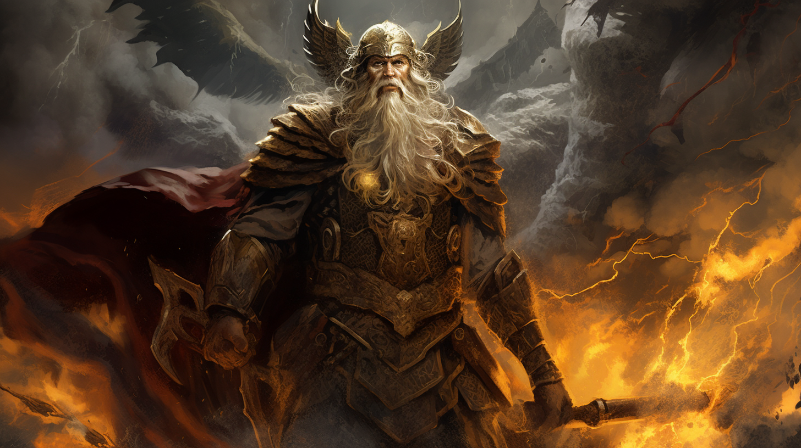

# 🔶 Odin Knowledge Graph

Odin is an in-memory, browser-first
[knowledge graph](https://en.wikipedia.org/wiki/Knowledge_graph).

> **Note:** Odin is currently in development. It is not yet ready for production
> use. We welcome you to try it out and provide feedback. If you encounter a
> bug, please
> [open an issue](https://github.com/WeCanDoBetter/delphi/issues/new) and help
> us improve the framework!

## Links

- [Odin Query Language](https://github.com/WeCanDoBetter/oql)
- [Delphi](https://wecandobetter.github.io/delphi/)
- [We Can Do Better](https://wcdb.life/)

Coded with ❤️ by [We Can Do Better](https://wcdb.life/).
